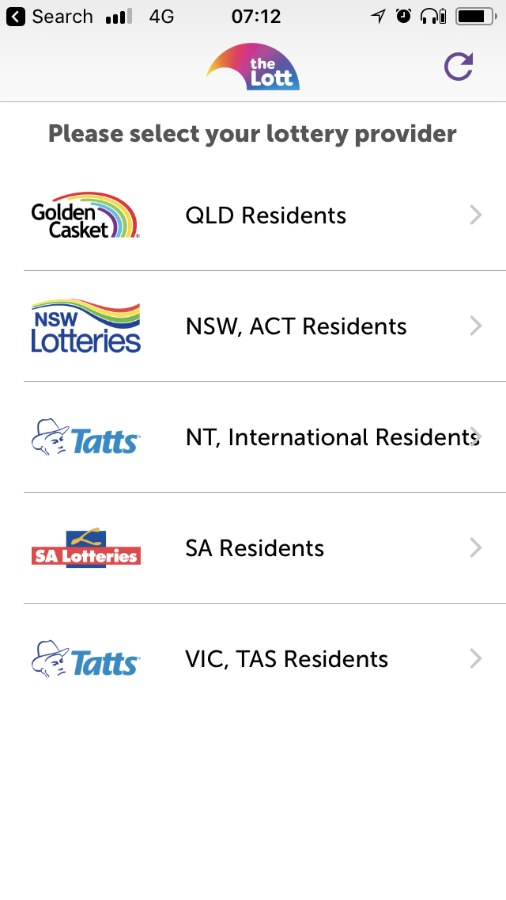
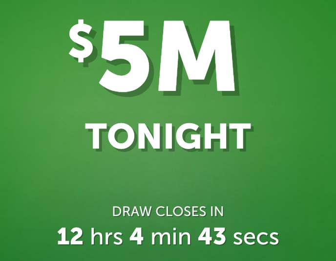

# coding-challenge

## What we are looking for

- Coding style / readability
- Understanding of the chosen language
- Understanding of the chosen platform / framework
- Solution design
- Code maintainablity, including testing
- Use of version control (preferably git)
- Any other techniques which would contribute to supportability of your code

## The Challenges

## 1. List Display
In this assignment you will be using JSON feed to read lotteries Jurisdictions/Companies and display them in a table like shown below.

Use the following as an example, but don't be constrained by our design or implementation choice.  The example below was taken from our IOS app, use the appropriate design idiom of your chosen plaform.



## 2. Coundown Timer

In this challenge you will be displaying a countdown timer such as the one below.  You may assume that the countdown will hit zero at 20:30 AEST every Tuesday.



## Platform Specifics

## Requirements (IOS)

- Swift 4.x with Xcode 9
- Screen uses MVVM pattern for unit testability and object oriented design
- Demonstrated Unit tests, testing ViewModel
- Isolate/Override network API invocation for Unit Tests

### Bonus Points

- Example of reactive programming (eg. View-ViewModel binding)
- You are free to use 3rd party libraries for Networking or Reactive (e.g. RxSwift)

## Requirements (Android)

- Java (or Kotlin)
- Uses MVP/MVVM pattern for unit testability and object oriented design
- Demonstrated Unit tests, testing ViewModel
- Isolate/Override network API invocation for Unit Tests

### Bonus Points

- Example of reactive programming (eg. View-ViewModel binding)
- You are free to use 3rd party libraries for Networking or Reactive (e.g. RxSwift)

## Requirements (Angular)

- Angular (2+)
- TypeScript
- Demonstrated Unit tests, testing components
- Isolate/Override network API invocation for Unit Tests

### Bonus Points

- Demonstrated use of redux pattern
- Browser / UI Automation of components
- You are free to use 3rd party libraries

## Requirements (Aurelia)

- Aurelia
- TypeScript
- Demonstrated Unit tests, testing components
- Isolate/Override network API invocation for Unit Tests

### Bonus Points

- Browser / UI Automation of components
- You are free to use 3rd party libraries

## Requirements (Web API)

- C# ASP.NET Core Web API
- Build a web API that returns static responses based upon the samples below
- Demonstrate use of unit testing
- Appropriate use of dependency injection

### Bonus Points

- Sample of abstracted configuration data
- Demonstrated use of suitable query and response caching
- Demonstration of Repository Pattern

## API endpoint details

## 1. Jurisdictions List

GET Request:
`https://api.thelott.com/svc/sales/vmax/web/data/lotto/companies`

Sample Response:

```
{
  "Companies": [
    {
      "CompanyId": "GoldenCasket",
      "CompanyDisplayName": "Golden Casket",
      "CompanyDescription": "QLD Residents",
      "CompanyLogoUrl": "http://media.tatts.com/TattsServices/Lotto/Companies/GoldenCasket_v1.png"
    },
    {
      "CompanyId": "NSWLotteries",
      "CompanyDisplayName": "NSW Lotteries",
      "CompanyDescription": "NSW, ACT Residents",
      "CompanyLogoUrl": "http://media.tatts.com/TattsServices/Lotto/Companies/NSWLotteries_v1.png"
    },
    {
      "CompanyId": "NTLotteries",
      "CompanyDisplayName": "NT Lotteries",
      "CompanyDescription": "NT, International Residents",
      "CompanyLogoUrl": "http://media.tatts.com/TattsServices/Lotto/Companies/Tatts_v1.png"
    },
    {
      "CompanyId": "SALotteries",
      "CompanyDisplayName": "SA Lotteries",
      "CompanyDescription": "SA Residents",
      "CompanyLogoUrl": "http://media.tatts.com/TattsServices/Lotto/Companies/SALotteries_v1.png"
    },
    {
      "CompanyId": "Tattersalls",
      "CompanyDisplayName": "Tattersall's",
      "CompanyDescription": "VIC, TAS Residents",
      "CompanyLogoUrl": "http://media.tatts.com/TattsServices/Lotto/Companies/Tatts_v1.png"
    }
  ],
  "ErrorInfo": null,
  "Success": true
}
```

## 2. Draw Closing Time

POST Request:
`https://api.thelott.com/svc/sales/vmax/web/data/lotto/opendraws`

Sample Request:
```
{
  "CompanyId": "GoldenCasket",
  "MaxDrawCount": 1,
  "OptionalProductFilter": [ "OzLotto" ]
}
```

Sample Response:

```
{
  "Draws": [
    {
      "ProductId": "OzLotto",
      "DrawNumber": 1252,
      "DrawDisplayName": "Oz Lotto $5,000,000",
      "DrawDate": "2018-02-13T00:00:00",
      "DrawLogoUrl": "http://media.tatts.com/TattsServices/Lotto/Products/OzLotto_v1.png",
      "DrawType": "Jackpot",
      "Div1Amount": 5000000.0000,
      "IsDiv1Estimated": false,
      "IsDiv1Unknown": false,
      "DrawCloseDateTimeUTC": "2018-02-13T09:35:00",
      "DrawEndSellDateTimeUTC": "2018-02-13T09:30:00",
      "DrawCountDownTimerSeconds": 42637.0
    }
  ],
  "ErrorInfo": null,
  "Success": true
}
```
